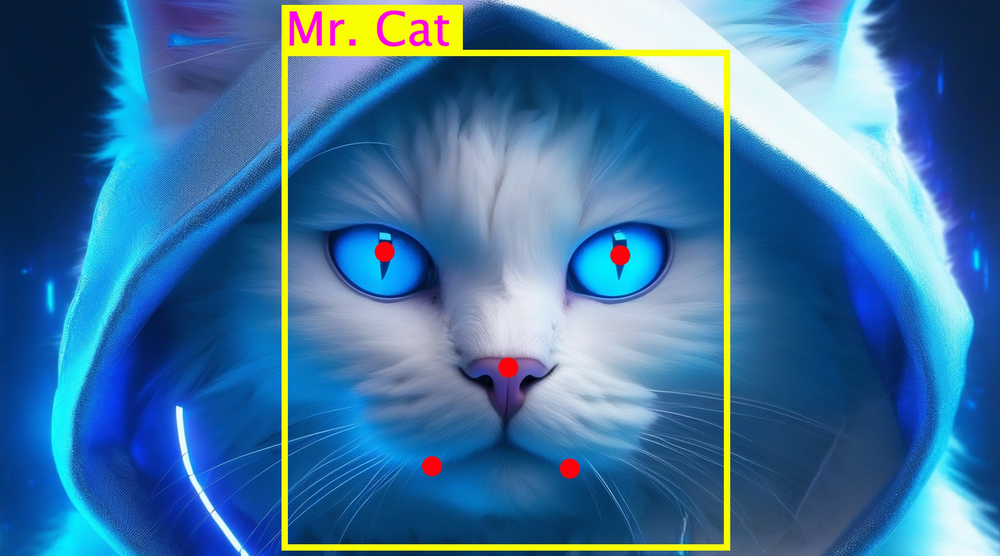

# Auto Annotator



[](https://codecov.io/gh/CatsWhoTrain/autoannotator)
[](https://badge.fury.io/py/autoannotator)


An extendable tool for automatic annotation of image data by a combination of deep neural networks.

The primary objective of this annotator is to prioritize the accuracy and quality of predictions over speed. The `autoannotator` has been specifically designed to surpass the precision offered by most publicly available tools. It leverages ensembles of deep neural models to ensure the utmost quality in its predictions. It is important to note that neural networks trained on clean datasets tend to yield superior results compared to those trained on larger but noisier datasets.

## Supported tasks
### Human Face Detection and Recognition
### Human Face Detection and Recognition
- [X] Face and landmarks detection 
- [X] Face alignment via keypoints
- [X] Face descriptor extraction

### Human Body Detection
- [X] UniHCP
- [X] IterDETR (Progressive DETR)
- [X] RTDETR, ResNet-101
- [X] InternImage-XL

### Other
- [X] DBSCAN clustering

## 📊 Benchmarks
### Face Recognition
#### Speed
| Task      | Hardware | Time, s |
| ---        | ---      | ---     |
| Face detection + landmarks + extraction |Xeon e5 2678 v3| ~1 |

### Human Detection
#### Quality
#### AP@50 when RT-DETR ResNet-18 was trained on CUHK-SYSU

| Test set    | Original Markup | Markup via DDQ-DETR | Markup via Ensemle |
| ----------- | --------------- | ------------------- | ------------------ |
| CrowdHuman  | 52.30           | 76.97               | 77.31              |
| WiderPerson | 54.66           | 60.89               | 63.71              |


## 🏗 Installation
### PIP package
```bash
pip install autoannotator
```

## 🚲 Getting started
### Face recognition example
Check out our demo face recognition pipeline at: `examples/face_recognition_example.py` 

#### [Optional] Run frontend and backend
```bash
git clone https://github.com/CatsWhoTrain/autoannotator_client
cd autoannotator_client
docker compose up
```
The webinterface could be found locally at: `http://localhost:8080/`

### Human full-body detection
Detailed description is given in the separate [document](docs/human_detection.md)
#### Human detection example
Check out our demo face recognition pipeline at: `examples/human_detection_example.py` 

## FAQ
### Do companies and engineers actually need this tool?
We have asked engineers in the field of video analytics whether they are interested in such a library. Their responses were:
- [IREX](https://irex.ai/): would use this library and contribute to it.
- [NapoleonIT](https://napoleonit.ru/): would use this library and contribute to it.
- [Linza Metrics](https://linzametrics.com/): would use this library.

### What are the reasons for choosing this data labeling tool over the alternative of employing human annotators?
#### Human accuracy is not so good
Long time ago Andrej Karpathy [observed](http://karpathy.github.io/2011/04/27/manually-classifying-cifar10/) that his accuracy was only 94% when he tried to label just 400 images of the CIFAR-10 dataset while SOTA [Efficient adaptive ensembling for image classification](https://onlinelibrary.wiley.com/doi/10.1111/exsy.13424) (August 29, 2023) achieves >99.6% accuracy.
When expert labelers had to choose from ~100 labels while annotating ImageNet, [their error rate increased to 13-15%](http://karpathy.github.io/2014/09/02/what-i-learned-from-competing-against-a-convnet-on-imagenet/).

Andrej's error rate was determined to be 5.1%, and he initially invested approximately one minute in labeling a single image. Conversely, utilizing [Florence](https://arxiv.org/abs/2111.11432v1) or never models for the same task can deliver a top-5 error rate of less than 1%.

##### Industry case: human face classification.
A certain undisclosed company, bound by a non-disclosure agreement (NDA), has utilized a technique wherein face images captured under challenging environmental conditions are pre-processed. This procedure involves the application of both a facial recognition network and DBSCAN algorithm to divide the images into distinct individuals. Subsequently, human annotators undertook a validation process to verify the accuracy of the pre-processed data. The work conducted by the annotators was inspected by their team leader. Ultimately, it was determined by an ML engineer that 1.4% of the clustered face images were mislabeled.


## 🏰 Legacy
Current repository takes ideas and some code form the following projects:
- [faces_detanator](https://github.com/IgorHoholko/faces_detanator)

## ✒ Legal
All individuals depicted in the "assets" images have provided explicit consent to utilize their photos for the purpose of showcasing the current library's work. Kindly refrain from utilizing these images within your individual projects.